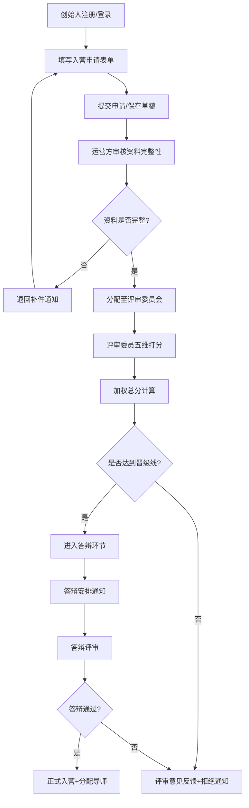
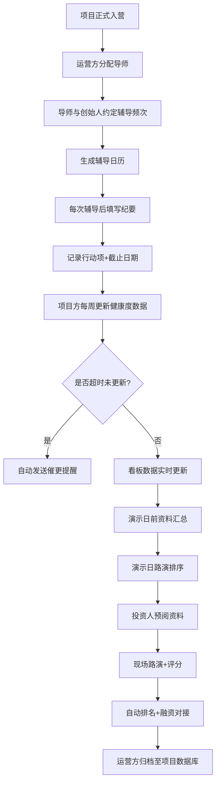

## 1. 产品概述

创业加速器项目管理平台，为孵化器/加速营提供从项目入营申请、评审筛选、导师配辅导、健康度追踪到演示日路演的全流程数字化管理。解决运营效率低、数据分散、评审不透明等核心问题，实现端到端的创业项目全生命周期管理。

- 核心价值：标准化评审流程，数字化导师辅导，数据驱动的项目健康度监控，提升加速器运营效率与孵化成功率
- 目标用户：创业团队（创始人）、评审委员、投资导师、加速器运营方、外部投资人

## 2. 核心功能

### 2.1 用户角色

| 角色 | 注册方式 | 核心权限 |
|------|----------|----------|
| 创始人 | 自行注册/运营方邀请 | 提交入营申请、更新项目数据、查看导师安排、填写会面纪要 |
| 评审委员 | 运营方分配账号 | 查看待评审项目、在线打分、提交评审意见 |
| 导师 | 运营方分配账号 | 查看分配项目、约定辅导频次、填写辅导纪要、追踪行动项 |
| 投资人 | 运营方邀请注册 | 演示日前查看项目资料、现场评分录入、查看排名 |
| 运营管理员 | 超级管理员创建 | 全功能管理：项目审核、导师配对、演示日安排、数据总览、历届对比 |

### 2.2 功能模块

1. **首页仪表盘**：运营总览、待办提醒、本期关键指标卡片、快速入口
2. **项目入营申请**：申请表单（项目介绍、商业模式、当前进展、融资需求）、申请进度追踪
3. **评审管理中心**：评审列表、打分界面（多维度评分+权重）、评审意见、自动晋级判定
4. **项目答辩管理**：答辩安排、答辩记录、最终结果
5. **导师配对与辅导**：导师列表、配对关系、辅导频次约定、会面纪要、行动项追踪
6. **项目健康度看板**：关键指标卡片（用户数/月营收/融资进展）、趋势折线图、数据更新提醒
7. **演示日管理**：路演顺序安排、项目资料预阅、现场评分录入、自动排名榜单
8. **运营数据总览**：整体进展仪表盘、导师配对统计、融资转化率、历届项目数据库对比
9. **项目数据库**：历届项目搜索、筛选、归档、对比分析

### 2.3 页面详情

| 页面名称 | 模块名称 | 功能描述 |
|----------|----------|----------|
| 首页仪表盘 | 运营总览卡片 | 展示本期项目数、在营项目、已融资项目、导师数等核心KPI |
| 首页仪表盘 | 待办事项列表 | 待评审申请、待安排辅导、待更新数据、即将到来的演示日提醒 |
| 首页仪表盘 | 快捷入口 | 新建申请、进入评审、安排演示日等一键跳转 |
| 项目申请页 | 申请表单 | 多步骤表单：基础信息→项目介绍→商业模式→当前进展→融资需求→提交 |
| 项目申请页 | 草稿保存 | 支持中途保存草稿，随时继续填写 |
| 项目申请页 | 进度追踪 | 展示申请当前状态（待审核/评审中/已通过/已拒绝） |
| 评审中心页 | 评审队列 | 按批次/状态筛选待评审项目列表 |
| 评审中心页 | 打分面板 | 团队(20%)、市场(25%)、产品(25%)、商业模式(20%)、融资合理度(10%)五维评分 |
| 评审中心页 | 评审意见 | 结构化评审意见输入区，支持推荐/待定/拒绝三选一 |
| 评审中心页 | 晋级判定 | 根据加权总分自动判定是否达线进入答辩环节 |
| 导师辅导页 | 配对概览 | 可视化展示导师-项目配对关系，支持调整配对 |
| 导师辅导页 | 辅导计划 | 导师与创始人约定辅导频次（每周/双周/月度），生成时间轴 |
| 导师辅导页 | 会面纪要 | 结构化纪要模板：讨论主题、关键决策、下一步行动项、截止日期 |
| 导师辅导页 | 行动项追踪 | 任务看板（待开始/进行中/已完成），逾期自动标红提醒 |
| 健康度看板页 | 指标卡片 | 用户数、月营收、融资进度三大核心指标，含同比环比 |
| 健康度看板页 | 趋势图表 | 折线图展示各指标12周滚动趋势 |
| 健康度看板页 | 数据录入 | 项目方每周更新表单，超时未更新自动发送提醒 |
| 健康度看板页 | 团队状态 | 列表展示各团队更新状态，支持一键催更 |
| 演示日页 | 路演安排 | 拖拽式排序路演顺序，时间轴展示，支持导出 |
| 演示日页 | 资料预览 | 投资人可提前查看项目BP、健康度数据、团队介绍 |
| 演示日页 | 评分录入 | 移动端友好的现场评分界面，团队/市场/产品/投后价值四维 |
| 演示日页 | 实时排名 | 评分实时更新排名榜单，支持导出报告 |
| 运营总览页 | 漏斗分析 | 申请数→入营数→获投数的转化漏斗 |
| 运营总览页 | 导师分析 | 导师辅导时长、辅导频次、所带项目融资情况统计 |
| 运营总览页 | 历届对比 | 多期项目关键指标横向对比表、雷达图 |
| 项目数据库 | 搜索筛选 | 按行业、阶段、融资状态、期数多维度筛选 |
| 项目数据库 | 项目详情 | 完整项目档案：申请资料、评审记录、辅导历史、健康度、融资结果 |

## 3. 核心流程

### 项目入营与评审流程

### 入营后运营流程

## 4. 用户界面设计

### 4.1 设计风格

- **主色调**：深邃靛蓝 (#1E3A8A) 为主色，搭配翠绿 (#059669) 作为健康/成功标识，琥珀橙 (#D97706) 用于提醒/待办
- **辅助色**：石板灰渐变作为背景基底，白色卡片配极细边框和柔和阴影
- **按钮风格**：圆角8px的精致按钮，主按钮采用靛蓝渐变+轻微悬浮效果，次要按钮为透明描边
- **字体方案**：展示字体使用 Playfair Display（标题/数据大字），正文字体使用 Inter（简体中文回退为 Noto Sans SC）
- **布局风格**：顶部导航+左侧二级菜单的经典B端布局，卡片式模块布局，大量留白配合12栅格系统
- **图标风格**：线性图标搭配彩色圆形背景，数据大屏使用拟物化渐变卡片

### 4.2 页面设计概览

| 页面名称 | 模块名称 | UI元素 |
|----------|----------|--------|
| 首页仪表盘 | KPI卡片 | 渐变背景大数字卡片，带趋势箭头小图，悬浮上浮动效 |
| 首页仪表盘 | 待办列表 | 左侧彩色状态条，悬停展开操作按钮 |
| 评审中心 | 打分面板 | 左右分栏：左侧项目资料，右侧滑动条评分器+标签式评语 |
| 健康度看板 | 指标区 | 三个大卡片展示核心指标，下方12周趋势图用渐变区域填充 |
| 健康度看板 | 团队状态 | 表格+信号灯列（绿/黄/红标识更新状态），行悬停显示操作 |
| 演示日页 | 排名榜 | 前三名领奖台式设计（金色/银色/铜色渐变背景），其他列表式 |
| 演示日页 | 路演时间轴 | 垂直时间轴，卡片式项目卡，支持拖拽排序 |
| 运营总览 | 漏斗图 | 渐变色块漏斗，每段显示数量和转化率，带hover详情 |
| 项目数据库 | 筛选区 | 顶部多条件筛选栏，卡片网格展示项目，点击展开抽屉详情 |

### 4.3 响应式设计

- **桌面端优先**：1440px及以上为最优体验，主内容区最大宽度1400px
- **平板适配**：1024px时左侧菜单折叠为图标模式，卡片两列布局
- **移动端**：768px以下底部Tab导航，评分表单优化为单列表单，重点保障演示日现场评分的移动端体验
- **触控优化**：评分滑块、拖拽操作、表格行均增加触控热区至44px以上

### 4.4 动效与交互细节

- 页面加载：顶部导航先出现，主内容区卡片按索引顺序错落淡入（50ms间隔）
- 数据更新：数字变化使用count-up动画，图表使用折线/柱状图从0到目标值的绘制动画
- 卡片交互：hover时轻微上浮(translateY:-2px)并增加阴影强度
- 状态切换：绿灯/黄灯/红灯状态切换使用脉冲动画
- 拖拽排序：被拖拽元素半透明放大，目标位置显示插入引导线
