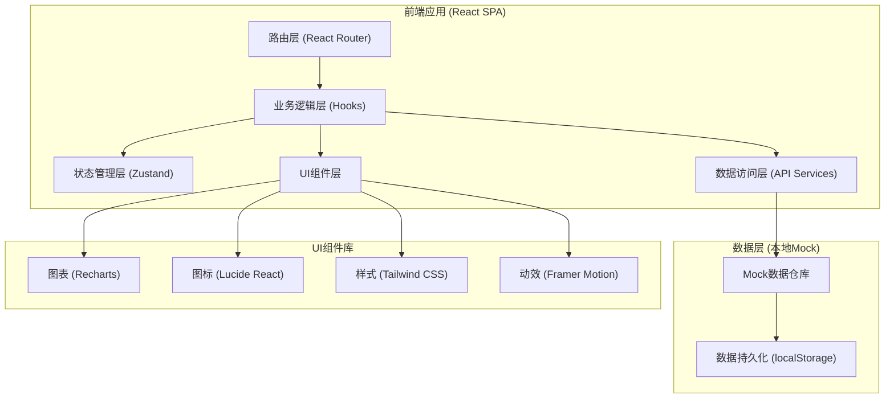

## 1. 架构设计



## 2. 技术描述

- **前端框架**：React@18 + TypeScript@5，采用函数式组件 + Hooks开发
- **构建工具**：Vite@5，启用HMR热更新、TypeScript严格模式
- **样式方案**：Tailwind CSS@3.4，配合CSS变量主题系统，支持深色模式预留
- **路由管理**：React Router@6，嵌套路由布局，支持路由守卫
- **状态管理**：Zustand@4，轻量级状态管理，按业务域拆分Store
- **图表可视化**：Recharts@2，折线图/柱状图/饼图/雷达图/漏斗图
- **图标库**：Lucide React，28px为主图标规格，线性风格
- **动画库**：Framer Motion，页面过渡、卡片悬浮、数字计数动画
- **日期处理**：date-fns@3，国际化中文本地化
- **后端/数据库**：无后端，使用TypeScript数据模型 + Mock数据 + localStorage持久化

## 3. 路由定义

| 路由路径 | 页面组件 | 功能说明 |
|----------|----------|----------|
| / | DashboardPage | 首页仪表盘：KPI卡片、待办提醒、快捷入口 |
| /applications | ApplicationsListPage | 项目申请列表：查看所有申请、状态筛选 |
| /applications/new | ApplicationFormPage | 新建入营申请：多步骤表单 |
| /applications/:id | ApplicationDetailPage | 申请详情：查看资料、进度追踪 |
| /reviews | ReviewCenterPage | 评审中心：评审队列、打分面板 |
| /reviews/:id | ReviewFormPage | 评审打分页：五维评分+意见 |
| /mentoring | MentoringOverviewPage | 导师辅导概览：配对关系、辅导日历 |
| /mentoring/meetings/:id | MeetingNotePage | 会面纪要填写：结构化纪要+行动项 |
| /health | HealthDashboardPage | 健康度看板：指标卡片、趋势图、更新提醒 |
| /health/update/:id | HealthUpdatePage | 健康度数据更新表单 |
| /demo-day | DemoDayPage | 演示日主页：路演安排+排名榜单+资料入口 |
| /demo-day/score/:projectId | DemoScorePage | 投资人现场评分页 |
| /analytics | AnalyticsPage | 运营数据总览：漏斗图、导师分析、历届对比 |
| /projects | ProjectsDatabasePage | 项目数据库：搜索、筛选、归档项目列表 |
| /projects/:id | ProjectArchivePage | 项目档案详情：完整历史资料 |

## 4. 数据模型定义

```typescript
// 用户模型
enum UserRole {
  FOUNDER = 'founder',
  REVIEWER = 'reviewer',
  MENTOR = 'mentor',
  INVESTOR = 'investor',
  ADMIN = 'admin',
}

interface User {
  id: string;
  name: string;
  email: string;
  role: UserRole;
  avatar?: string;
  phone?: string;
  organization?: string;
  title?: string;
  createdAt: string;
}

// 项目申请模型
enum ApplicationStatus {
  DRAFT = 'draft',
  SUBMITTED = 'submitted',
  UNDER_REVIEW = 'under_review',
  REVIEW_PASSED = 'review_passed',
  REVIEW_REJECTED = 'review_rejected',
  DEFENSE_SCHEDULED = 'defense_scheduled',
  ACCEPTED = 'accepted',
  REJECTED = 'rejected',
}

interface Application {
  id: string;
  batch: string; // 期别，如 "2026-Spring"
  status: ApplicationStatus;
  
  // 基础信息
  projectName: string;
  logoUrl?: string;
  industry: string;
  stage: string; // 种子轮/天使轮/A轮前
  registrationDate: string;
  website?: string;
  
  // 团队信息
  teamSize: number;
  founders: Founder[];
  headquarters: string;
  
  // 项目介绍
  elevatorPitch: string; // 一句话介绍
  problemStatement: string; // 解决什么问题
  solutionDescription: string; // 解决方案
  targetMarket: string; // 目标市场
  
  // 商业模式
  businessModel: string; // 商业模式描述
  revenueModel: string; // 收入模式
  competitiveAdvantage: string; // 竞争优势
  competitors: string; // 竞品分析
  
  // 当前进展
  productStatus: string; // 产品状态（概念/原型/MVP/已有用户）
  userMetrics: string; // 用户数据
  currentTraction: string; // 当前业务进展
  milestones: Milestone[];
  
  // 融资需求
  fundingAmount: number; // 融资金额（万元）
  equityOffered: number; // 出让股权%
  useOfFunds: string; // 资金用途
  nextMilestone: string; // 融资后里程碑
  
  submitterId: string;
  submittedAt?: string;
  createdAt: string;
  updatedAt: string;
}

interface Founder {
  id: string;
  name: string;
  role: string;
  background: string; // 背景介绍
  linkedin?: string;
}

interface Milestone {
  id: string;
  title: string;
  targetDate: string;
  status: 'pending' | 'achieved' | 'overdue';
  description?: string;
}

// 评审模型
interface ReviewScore {
  team: number;      // 团队 0-100，权重20%
  market: number;    // 市场 0-100，权重25%
  product: number;   // 产品 0-100，权重25%
  business: number;  // 商业模式 0-100，权重20%
  funding: number;   // 融资合理度 0-100，权重10%
}

enum ReviewDecision {
  RECOMMEND = 'recommend',
  PENDING = 'pending',
  REJECT = 'reject',
}

interface Review {
  id: string;
  applicationId: string;
  reviewerId: string;
  scores: ReviewScore;
  weightedTotal: number;
  decision: ReviewDecision;
  strengths: string[]; // 优势标签
  concerns: string[];  // 顾虑标签
  comment: string;     // 综合评语
  createdAt: string;
}

// 答辩模型
interface Defense {
  id: string;
  applicationId: string;
  scheduledAt: string;
  duration: number; // 分钟
  panelistIds: string[];
  location: string;
  result?: 'pass' | 'fail';
  notes?: string;
  finalScore?: number;
}

// 导师配对模型
interface MentorAssignment {
  id: string;
  applicationId: string;
  projectId: string;
  mentorId: string;
  frequency: 'weekly' | 'biweekly' | 'monthly';
  startDate: string;
  endDate?: string;
  status: 'active' | 'completed' | 'terminated';
}

// 会面纪要模型
interface MeetingNote {
  id: string;
  assignmentId: string;
  projectId: string;
  mentorId: string;
  heldAt: string;
  duration: number; // 分钟
  format: 'in_person' | 'video' | 'phone';
  topics: string[];
  keyDecisions: string[];
  nextSteps: ActionItem[];
  summary: string;
  createdBy: string;
  createdAt: string;
  coSignedBy?: string[];
}

interface ActionItem {
  id: string;
  description: string;
  assignee: string;
  dueDate: string;
  status: 'todo' | 'in_progress' | 'done' | 'overdue';
  completedAt?: string;
}

// 健康度数据模型
interface HealthMetric {
  id: string;
  projectId: string;
  weekEnding: string; // 周截止日
  userCount: number;      // 用户数
  monthlyRevenue: number; // 月营收（万元）
  fundingProgress: number; // 融资进度 0-100%
  notes?: string;
  submittedAt: string;
  submittedBy: string;
  isOverdue: boolean;
}

// 演示日模型
interface DemoDayEvent {
  id: string;
  batch: string;
  title: string;
  date: string;
  venue: string;
  status: 'upcoming' | 'ongoing' | 'completed';
  projectOrder: string[]; // 路演顺序：projectId数组
  participantInvestorIds: string[];
}

interface DemoDayScore {
  id: string;
  demoDayId: string;
  projectId: string;
  investorId: string;
  teamScore: number;     // 团队 0-25
  marketScore: number;   // 市场 0-25
  productScore: number;  // 产品 0-25
  valueScore: number;    // 投后价值 0-25
  totalScore: number;    // 总分 0-100
  interestLevel: 'low' | 'medium' | 'high' | 'must_have';
  comments: string;
  createdAt: string;
}

// 在营项目模型
interface ActiveProject {
  id: string;
  applicationId: string;
  batch: string;
  acceptedAt: string;
  graduationDate?: string;
  status: 'active' | 'graduated' | 'dropped';
  mentorIds: string[];
  finalFundingAmount?: number;
  fundingStatus: 'not_started' | 'negotiating' | 'closed' | 'failed';
}
```

## 5. 状态管理Store架构

```typescript
// stores/index.ts
- useAuthStore: 当前用户、角色、登录状态
- useApplicationStore: 项目申请CRUD、状态流转
- useReviewStore: 评审打分、评审意见管理
- useMentoringStore: 导师配对、会面纪要、行动项
- useHealthStore: 健康度数据、提醒状态
- useDemoDayStore: 演示日安排、评分、排名
- useAnalyticsStore: 运营统计数据、漏斗、对比数据
```

## 6. 前端目录结构

```
src/
├── main.tsx                 # 应用入口
├── App.tsx                  # 根组件+路由
├── index.css                # Tailwind入口+全局样式
├── assets/                  # 静态资源
├── components/
│   ├── layout/              # 布局组件（Header, Sidebar, PageContainer）
│   ├── common/              # 通用组件（Button, Card, Modal, Table, Badge）
│   ├── charts/              # 图表封装组件
│   └── features/            # 各模块专属组件
│       ├── applications/
│       ├── reviews/
│       ├── mentoring/
│       ├── health/
│       ├── demo-day/
│       └── analytics/
├── pages/                   # 页面级组件（对应路由表）
├── stores/                  # Zustand状态Store
├── types/                   # TypeScript类型定义
├── data/                    # Mock数据工厂
├── hooks/                   # 自定义业务Hooks
├── utils/                   # 工具函数（日期、分数计算、格式化）
└── lib/                     # 第三方库初始化封装
```

## 7. 关键业务算法

### 7.1 加权评分算法
```typescript
function calculateWeightedScore(scores: ReviewScore): number {
  const weights = { team: 0.20, market: 0.25, product: 0.25, business: 0.20, funding: 0.10 };
  return scores.team * weights.team
       + scores.market * weights.market
       + scores.product * weights.product
       + scores.business * weights.business
       + scores.funding * weights.funding;
}
// 晋级线：加权总分 >= 70 自动晋级答辩
```

### 7.2 健康度更新判定
```typescript
function isHealthUpdateOverdue(lastSubmission: Date): boolean {
  const today = new Date();
  const daysDiff = (today.getTime() - lastSubmission.getTime()) / (1000 * 60 * 60 * 24);
  return daysDiff > 7; // 超过7天未更新为逾期
}
```

### 7.3 演示日排名算法
```typescript
function calculateProjectRank(demoDayId: string): RankedProject[] {
  // 按项目分组，计算所有投资人评分的加权平均分
  // 前3名权重：去掉最低分+最高分后取平均
  // 返回按总分降序排列的项目列表
}
```
